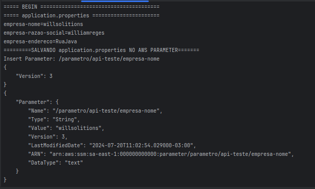
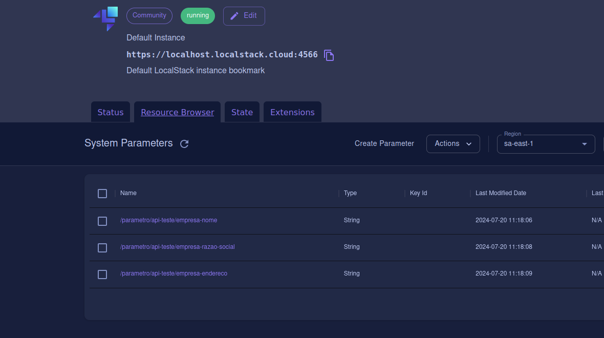
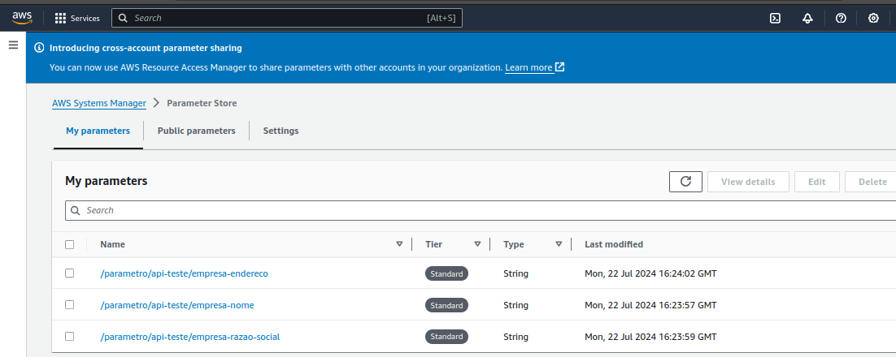
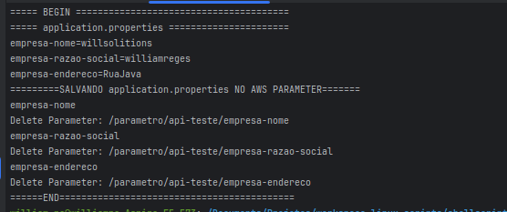

# Script para Parameter Store

---

#### [Comece com Simple System Manager(SSM) no LocalStack ](https://docs.localstack.cloud/user-guide/aws/ssm/)

O Systems Manager (SSM) é um serviço de gerenciamento fornecido pela Amazon Web Services que ajuda você a gerenciar e
controlar com eficácia os recursos de sua infraestrutura. O SSM simplifica tarefas relacionadas ao gerenciamento de
sistemas e aplicativos, aplicação de patches, configuração e automação, permitindo manter a integridade e a conformidade
do seu ambiente.

* [1. Persistir Parametros](#1-persistir-parametros)
  * [Persistir properties no Parameter Store LocalStack](#persistir-properties-no-parameter-store-localstack) 
  * [Persistir properties no Parameter Store na AWS](#persistir-properties-no-parameter-store-na-aws) 
* [2, Deletar Parametros](#2-deletar-parametros)
    * [Remover properties no Parameter Store LocalStack](#remover-properties-no-parameter-store-localstack)
    * [Remover properties no Parameter Store na AWS](#remover-properties-no-parameter-store-aws)

## 1. Persistir Parametros

### Persistir properties no Parameter Store LocalStack

Nesse exemplo iremos demosntrar como criar parametros no Parameter Store do SSM rodando um shell script
`insert-properties-to-parameter-store-localstack.sh` onde o mesmo
irá ler parametros de um arquivo `application.properties` de um projeto spring por exemplo e persistir cada key-value
dentro do SSM.

```shell
 bash insert-properties-to-parameter-store-localstack.sh
```
Ao rodar o shell será mostrado logs parecido com exemplo abaixo demonstrando que os parametros estão persistidos dentro
do parameter store do SSM localstack



E pára ver de forma visual no LocalStack veja o recurso:
[LocalStack Desktop SSM](https://app.localstack.cloud/inst/default/resources/ssm)



### Persistir properties no Parameter Store na AWS

Como no exemplo anterior rode o shell script
`insert-properties-to-parameter-store.sh` onde o mesmo
irá ler parametros de um arquivo `application.properties` e persistir direto na sua conta aws corrente

```shell
 bash insert-properties-to-parameter-store.sh
```

E para ver de forma visual na conta AWS veja o recurso em ***conta aws -> SSM -> Parameter Store***:



## 2. Deletar Parametros

### Remover properties no Parameter Store LocalStack
Nesse exemplo iremos demosntrar como remover parametros no Parameter Store do SSM rodando um shell script
`delete-properties-from-parameter-store-localstack.sh` onde o mesmo
irá ler parametros de um arquivo `application.properties` de um projeto spring por exemplo e remover cada key-value
dentro do SSM.

```shell
bash delete-properties-from-parameter-store-localstack.sh
```
Ao rodar o shell será mostrado logs parecido com exemplo abaixo demonstrando que os parametros estão sendo removidos de 
dentro do parameter store do SSM localstack



### Remover properties no Parameter Store AWS
Como no exemplo anterior para remover parametros no Parameter Store do SSM rodando um shell script
`delete-properties-from-parameter-store.sh` o script
irá ler parametros de um arquivo `application.properties` de um projeto spring por exemplo e remover cada key-value
dentro do SSM na conta AWS corrente.

```shell
bash delete-properties-from-parameter-store.sh
```
---

> Obs:
> 
> Existe o arquivo `aws-parameter-config.properties` que nada mas é que um input de informações para ajudar o script
> * **tipo.configuracao:** prefixo a ser montado na key como `"parametro"`
> * **nome.projeto=api-teste:** nome do projeto como `"api-teste"`
> * **nome.arquivo.properties:** nome do arquivo a ser varrido para leitura como `application.properties` criando no 
> script key-value
> 
> O formato dos properties obtido de application.properties terá o formato `/parametro/api-teste/key`
---

## Referencias

Veja mais assunto avançado em:
- [Doc AWS Systems Manager](https://docs.aws.amazon.com/systems-manager/)
- [Doc AWS Systems Manager Parameter Store](https://docs.aws.amazon.com/systems-manager/latest/userguide/systems-manager-parameter-store.html)
- [AWS CLI Command Referenc SSM](https://awscli.amazonaws.com/v2/documentation/api/latest/reference/ssm/index.html)