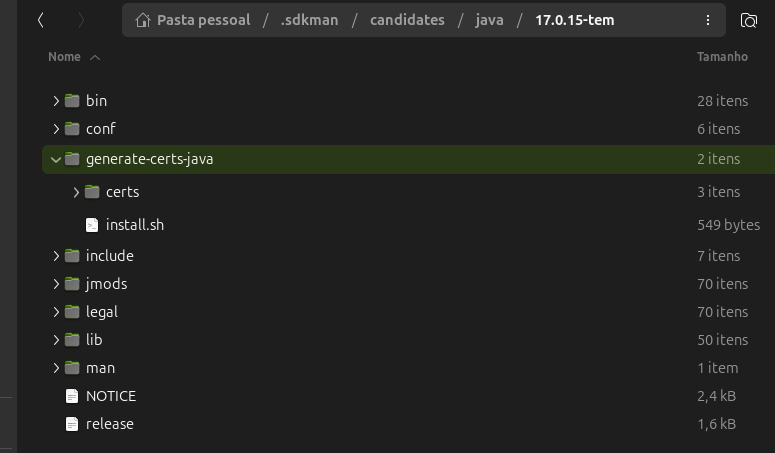

# Instalação de Certificados Java

Este projeto contém um script Bash [`install.sh`](install.sh) para automatizar a instalação de certificados em um keystore Java.

## Propósito

O script instala todos os certificados encontrados na pasta [`certs/`](certs/) no keystore padrão do Java (`cacerts`). Ele utiliza o utilitário `keytool` para importar cada certificado, facilitando o processo de configuração de ambientes que exigem certificados personalizados.

## Funcionamento

- Percorre todos os arquivos na pasta [`certs/`](certs/).
- Para cada arquivo, extrai o nome do alias (baseado no nome do arquivo).
- Executa o comando `keytool -import` para importar o certificado no keystore.
- O keystore utilizado é `../lib/security/cacerts` e a senha padrão é `changeit`.

## Onde clonar o projeto
1. Clone o projeto para sua máquina local
2. Coloque dentro da pasta do java corrente em que deseja importar seus certificaos conforme exemplo abaixo:



## Como usar

1. Certifique-se de que os certificados estão na pasta [`certs/`](certs/).
2. Execute o script:

   ```sh
   bash install.sh
   ```

3. Aguarde a finalização do processo.

## Observações

- O script pressupõe que o utilitário `keytool` está disponível em `../bin/keytool`.
- O keystore de destino é `../lib/security/cacerts`.
- A senha padrão do keystore é `changeit`.
- Os certificados devem estar no formato suportado pelo `keytool`.

## Estrutura de Pastas

```
install.sh
certs/
    broker.crt
    localhost.crt
    schema-registry.crt
```

